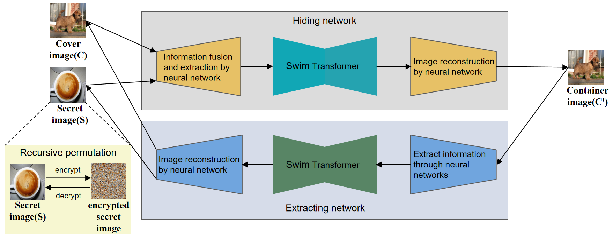

## Introduction
This project is the open source code for the paper titled "Deep image steganography using transformer and recursive permutation". It implements an image steganography model based on Swim-Transformer and chaotic recursive scrambling encryption.

## Dependencies & Installation & Usage
1. Clone or download this repository

2. Install the dependencies 

   ```
   pip install -r requirements.txt
   ```

3. If you just want to inference via the model

   ```
   # Steganography an image using the h1 model. 
   CUDA_VISIBLE_DEVICES=0 python testSwimUnet.py --Hnet="checkpoint/h1_netH.pth" --Rnet="checkpoint/h1-netR.pth" --test=./example_pics
   # Steganography two images using the h2 model.
   CUDA_VISIBLE_DEVICES=0 python testThreeSwimUnet.py --Hnet="checkpoint/h2_netH.pth" --Rnet="checkpoint/h2-netR.pth" --test=./example_pics
   # A model for steganography using recursively scrambled encrypted images.
   CUDA_VISIBLE_DEVICES=0 python testEncryptSwimUnet.py --Hnet="checkpoint/encrypt_netH.pth" --Rnet="checkpoint/encrypt_netR.pth" --test=./example_pics
   ```
4. Additional options

The script has some additional options to control its behavior:

* `--ngpu`: Number of GPU blocks used.
* `--testPics`: The path to save the result image.
* `--outlogs`: The storage path of the output log.
* `--imageSize`: Enter the size of the image, the default open source training model parameter of this project is 144.
## Research
We open source the code of the entire model architecture in the paper, including the recursive chaos scrambling encryption part and the Swim-transformer-based image steganography part. At the same time, We provide the model weights after training of the three models mentioned in the paper in the `checkpoint` folder, including `h1_model`, `h2_model` and `encryption_model`. Readers can use our code to perform the image steganography proposed in the paper. Researchers can conduct further research based on this open source code.


